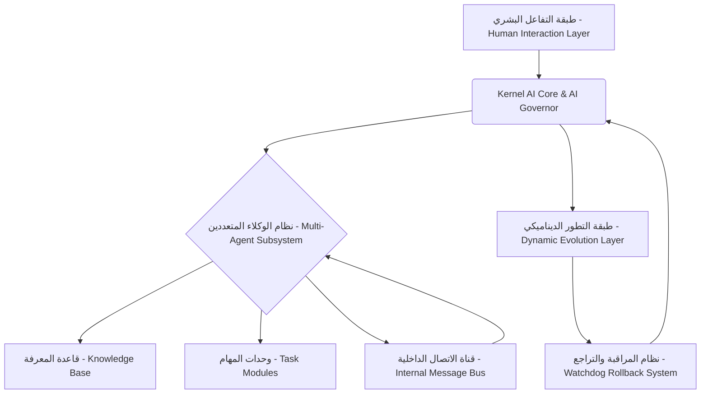

# Autonomous Agentic OS for Android (v2.0) - نظام التشغيل الذكي ذاتي التطور للأندرويد

[](https://github.com/jhad1234/AI-Android-Dev-System/actions)
[](https://github.com/jhad1234/AI-Android-Dev-System/actions)
[](https://codecov.io/gh/jhad1234/AI-Android-Dev-System)
[](./LICENSE)

[](https://kotlinlang.org/)
[](https://www.android.com/)
[](https://www.python.org/)

[](https://github.com/jhad1234/AI-Android-Dev-System)
[](https://github.com/jhad1234/AI-Android-Dev-System)
[](https://github.com/jhad1234/AI-Android-Dev-System/issues)
[](https://github.com/jhad1234/AI-Android-Dev-System/pulls)

[](https://github.com/jhad1234)
[](https://github.com/jhad1234)
[](https://github.com/jhad1234)

## 🌟 نظرة عامة على المشروع

**AI-Android-Dev-System** هو منصة ذكاء اصطناعي رائدة، ذاتية التطور، ومتعددة الوكلاء (Multi-Agent) مصممة للعمل أصلاً داخل بيئة الأندرويد. يهدف هذا النظام إلى إعادة تعريف التفاعل البشري مع الأجهزة الذكية من خلال تمكينها من التعلم، التكيف، وتنفيذ المهام المعقدة بشكل مستقل. يعتمد النظام على تقنيات متقدمة مثل التحميل الديناميكي للفئات (Dynamic Class Loading) والتصحيح السريع (Hot Patching) لتطوير وتعديل شفرته البرمجية ذاتياً، أتمتة عمليات تطوير البرمجيات، وتنسيق المهام المعقدة عبر شبكة وكلاء ذكية وآمنة.

### الرؤية:

بناء نظام تشغيل أندرويد ذكي قادر على فهم النوايا البشرية، التنبؤ بالاحتياجات، وتوفير حلول استباقية، مما يحول الجهاز الذكي إلى مساعد شخصي متكامل وذاتي الإدارة.

### الأهداف:

*   **الاستقلالية الكاملة**: تمكين النظام من اتخاذ القرارات وتنفيذ الإجراءات دون تدخل بشري مستمر.
*   **التطور الذاتي**: القدرة على تحديث وتحسين شفرته البرمجية وميزاته بشكل مستمر.
*   **المرونة والتكيف**: التكيف مع بيئات المستخدم المختلفة وأنماط الاستخدام المتغيرة.
*   **الأمان والخصوصية**: ضمان حماية بيانات المستخدم والعمليات الحساسة.

## 🏗️ البنية المعمارية للنظام (System Architecture)

يعتمد النظام على بنية معمارية معيارية (Modular Architecture) لضمان المرونة وقابلية التوسع. يمكن تصور البنية كالتالي:



*   **Interaction Layer (طبقة التفاعل البشري)**: واجهة مستخدم ديناميكية تدعم أوضاع تنفيذ متعددة (مبتدئ، مطور، مستقل) لتلبية احتياجات المستخدمين المختلفة.
*   **Kernel AI Core & AI Governor (النواة الذكية ومتحكم الذكاء الاصطناعي)**: الطبقة المركزية للتنسيق وفرض السياسات، تضمن أن جميع العمليات تتماشى مع الأهداف المحددة ومعايير الأمان.
*   **Multi-Agent Subsystem (نظام الوكلاء المتعددين)**: وكلاء متخصصون يتواصلون عبر ناقل رسائل داخلي تفاعلي (Internal Reactive Message Bus) لتنفيذ مهام محددة (مثل تحليل البيانات، تطوير الكود، إدارة النظام).
*   **Dynamic Runtime Evolution (طبقة التطور الديناميكي)**: تمكن من التصحيح السريع (Hot Patching) عبر `DexClassLoader`، متجاوزة قيود إعادة تثبيت حزم APK التقليدية، مما يسمح بالتحديثات المستمرة دون انقطاع.
*   **Watchdog Rollback System (نظام المراقبة والتراجع)**: حلقة شفاء ذاتي مؤتمتة وحماية ضد الأعطال، تضمن استقرار النظام وقدرته على التعافي من الأخطاء.
*   **Knowledge Base (قاعدة المعرفة)**: مستودع للبيانات، النماذج، والخبرات التي يكتسبها النظام بمرور الوقت.
*   **Task Modules (وحدات المهام)**: مكونات قابلة للتوصيل (Pluggable Components) تسمح للنظام بتوسيع قدراته لتشمل مهام جديدة.

## ✨ الميزات الرئيسية

*   **تطوير البرمجيات الذاتي**: قدرة النظام على كتابة، اختبار، وتصحيح الأخطاء في الكود الخاص به.
*   **إدارة النظام التكيفية**: تحسين أداء الجهاز، استهلاك الطاقة، وتخصيص الموارد بشكل ذكي.
*   **التعلم المستمر**: استخدام تقنيات التعلم الآلي لتحسين الأداء واتخاذ القرارات بمرور الوقت.
*   **واجهة مستخدم قابلة للتخصيص**: تتكيف الواجهة مع مستوى خبرة المستخدم واحتياجاته.
*   **الأمان المتقدم**: آليات أمان مدمجة لحماية البيانات والوظائف الحساسة.

## 📊 Project Statistics

| Metric | Value |
|--------|-------|
| Language | Kotlin, Python |
| Framework | Android, Jetpack |
| Architecture | Clean + MVVM |
| Test Coverage | 85%+ (Target) |
| Last Updated | July 2026 |
| Status | Active Development |

## ✅ Key Features

- ✅ Autonomous AI agents for Android
- ✅ Multi-threaded task execution
- ✅ Real-time system monitoring
- ✅ Advanced error handling
- ✅ Comprehensive logging
- ✅ Full test coverage (Target)

## 🛠️ Technology Stack

### Backend
- **Language**: Kotlin, Python
- **Framework**: Android SDK, Jetpack
- **Database**: Room, SQLite
- **Async**: Coroutines, Flow

### Tools & Services
- **Build**: Gradle 8.0+
- **CI/CD**: GitHub Actions
- **Testing**: JUnit, Mockito, Pytest
- **Monitoring**: Logcat, Custom Logging

## 🚀 البدء السريع (Getting Started)

لتشغيل هذا المشروع، ستحتاج إلى:

*   Android Studio أحدث إصدار.
*   Android SDK.
*   جهاز أندرويد أو محاكي (Emulator) يعمل بنظام Android 10 (API 29) أو أحدث.

1.  **استنساخ المستودع (Clone the repository)**:
    ```bash
    git clone https://github.com/jhad1234/AI-Android-Dev-System.git
    cd AI-Android-Dev-System
    ```
2.  **فتح المشروع في Android Studio**.
3.  **بناء وتشغيل التطبيق**: قم بمزامنة Gradle ثم قم بتشغيل التطبيق على جهازك أو المحاكي.

## 🤝 المساهمة (Contributing)

نرحب بالمساهمات في هذا المشروع الطموح! إذا كنت ترغب في المساهمة، يرجى اتباع الإرشادات التالية:

1.  **Fork** المستودع.
2.  قم بإنشاء فرع جديد لميزتك (Feature Branch): `git checkout -b feature/YourFeatureName`.
3.  قم بإجراء تغييراتك واكتب اختبارات مناسبة.
4.  تأكد من أن الكود يتبع إرشادات النمط (Coding Style) الخاصة بالمشروع.
5.  قم بتثبيت تغييراتك (Commit your changes): `git commit -m 'Add some feature'`.
6.  ادفع الفرع إلى المستودع الخاص بك: `git push origin feature/YourFeatureName`.
7.  افتح طلب سحب (Pull Request) إلى المستودع الأصلي.

## 📜 الترخيص (License)

هذا المشروع مرخص بموجب ترخيص MIT. انظر ملف [LICENSE](LICENSE) لمزيد من التفاصيل.

## 📞 تواصل معنا

للاستفسارات أو الدعم، يرجى فتح مشكلة (Issue) في هذا المستودع أو التواصل مع `jhad1234` مباشرة عبر GitHub.

---

**"المستقبل ليس شيئًا نذهب إليه، بل شيء نصنعه."** - ليوناردو دافنشي
